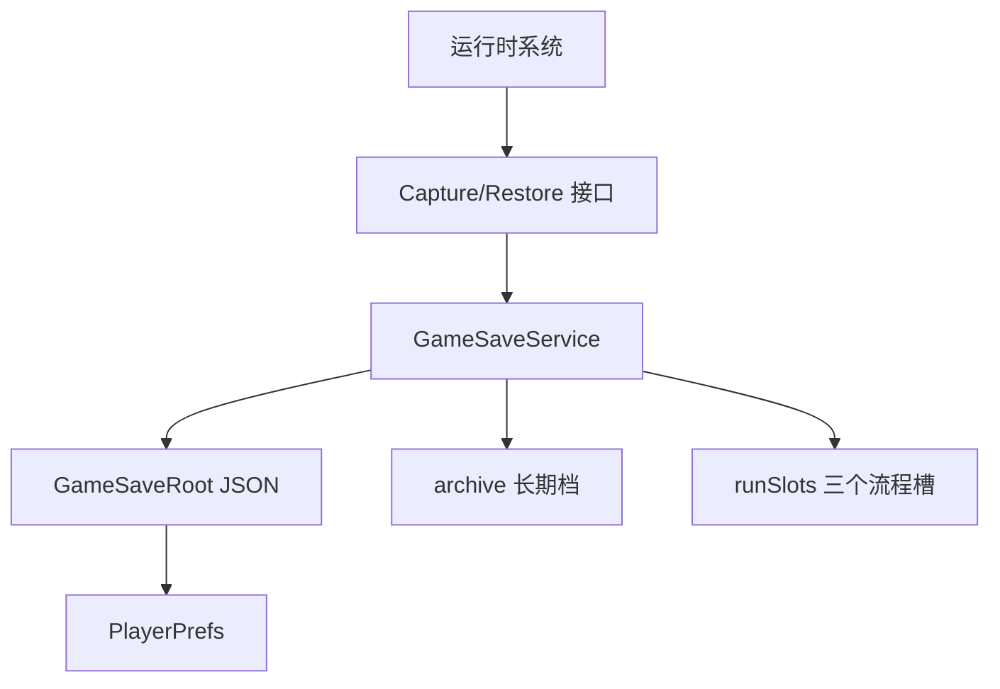

# 变更提案: webgl_save_system

## 元信息
```yaml
类型: 新功能
方案类型: implementation
优先级: P1
状态: 已实施
创建: 2026-06-11
复杂度: complex
子代理: 未调用，当前工具要求用户显式授权子代理，已由主流程降级执行
```

---

## 1. 需求

### 背景
游戏计划发布为 WebGL/HTML5 小游戏，需要在同一浏览器内持久保存玩家长期解锁内容和最多 3 个游戏流程存档。

### 目标
- 长期档保存物品图鉴解锁和人物结局解锁。
- 3 个游戏内流程槽位保存回合结束后的流程快照。
- 新开游戏只重置流程状态，不清空长期图鉴和人物结局。
- 删除或覆盖流程槽位不会影响长期档。
- 读档后进入已保存的下一回合开始状态。

### 约束条件
```yaml
存储方式: Unity PlayerPrefs 保存 JSON 根对象，WebGL 下由浏览器站点数据持久化
数据边界: 长期档 archive 与流程档 runSlots 分离
流程档状态: 当前回合、灵石、商店增益、NPC 运行时状态、仓库、下一回合特殊来访者
NPC 不保存字段: 名称、描述、头像等资源字段不存入流程档
```

### 验收标准
- [x] C# 编译通过，无错误无警告。
- [x] 图鉴/结局长期档不被新游戏重置。
- [x] 回合结束并成功进入下一回合后可保存到 3 个槽位。
- [x] 读档恢复灵石、仓库、增益、回合和 NPC 运行时状态。

---

## 2. 方案

### 技术方案
新增 `GameSaveService` 作为唯一存档入口，使用 `JsonUtility` 将 `GameSaveRoot` 序列化到 `PlayerPrefs`。`GameSaveRoot` 内部分为 `archive` 和 `runSlots`，分别承载长期档和 3 个流程档。流程状态由各运行时系统提供 Capture/Restore 接口。

### 影响范围
```yaml
涉及模块:
  - Save: 新增存档数据模型、存档服务、启动上下文、存档槽面板控制器
  - MainScene: 新游戏/读档流程、回合结束存档点、HUD 初始化逻辑
  - ShopMainScene: NPC 事件调度器和 NPCDefinition 运行时状态快照
  - Warehouse: 仓库物品快照与恢复
  - GuideBook/Ending: 长期图鉴与结局保存恢复
预计变更文件: 15+
```

### 风险评估
| 风险 | 等级 | 应对 |
|------|------|------|
| Unity 场景中未绑定存档面板 | 中 | `SaveSlotPanelController` 可在运行时创建基础按钮，但仍建议后续制作正式 UI |
| WebGL 浏览器站点数据被用户清理 | 中 | 属于浏览器本地存储特性，后续可在 UI 文案中提示 |
| `PlayerPrefs` 容量限制 | 低 | 当前存档仅保存 ID 和少量状态，预计远低于 1MB |
| 读档恢复随机货架的精确状态 | 中 | 当前需求指定恢复到下一回合开始，未保存坊市货架中途状态 |

---

## 3. 技术设计

### 架构设计


### 数据模型
| 字段 | 类型 | 说明 |
|------|------|------|
| `archive.unlockedItemIds` | `List<string>` | 明确解锁的物品 ID |
| `archive.unlockedEndings` | `List<EndingSaveData>` | 人物结局记录，含展示兜底名称 |
| `runSlots[3]` | `RunSaveSlotData` | 固定三个流程槽 |
| `RunSaveData.currentRound` | `int` | 读取后所处回合 |
| `RunSaveData.economyBuff` | `EconomyBuffSaveData` | 商店增益等级与阈值进度 |
| `RunSaveData.npcStates` | `List<NpcSaveData>` | NPC 事件、属性、Prompt |
| `RunSaveData.warehouseItems` | `List<WarehouseItemSaveData>` | 仓库物品 ID 与数量 |

---

## 4. 核心场景

### 场景: 新游戏
**模块**: StartMenu/MainScene
**条件**: 用户点击开始游戏。
**行为**: 加载长期档，播放序章，重置灵石、仓库、NPC、回合、增益等流程状态。
**结果**: 已解锁图鉴和结局保留，流程从新游戏开始。

### 场景: 回合结束保存
**模块**: MainScene
**条件**: 用户离开 NPC 场景并成功推进到下一回合。
**行为**: 先处理回合结束收益、增益升级、事件调度，再显示 3 槽存档选择。
**结果**: 用户可覆盖任一流程槽或跳过保存。

### 场景: 读档
**模块**: StartMenu/MainScene
**条件**: 用户选择一个已有流程槽。
**行为**: 在加载 `MainScene` 前设置待恢复上下文，跳过新游戏重置，加载后应用流程快照并进入坊市。
**结果**: 进入保存时记录的下一回合开始状态。

---

## 5. 技术决策

### webgl_save_system#D001: 使用 PlayerPrefs 保存 JSON 根对象
**日期**: 2026-06-11
**状态**: 采纳
**背景**: 用户熟悉 JSON，本项目当前没有浏览器 JS 桥接代码。
**选项分析**:
| 选项 | 优点 | 缺点 |
|------|------|------|
| PlayerPrefs + JSON | C# 内实现简单，WebGL 可用，后续可替换底层 | WebGL 容量有限，不适合大量数据 |
| localStorage JS 插件 + JSON | 浏览器 DevTools 可直接查看，语义更贴近网页 | 需要维护 JS bridge |
| 自定义文件/服务器存档 | 扩展性强 | 对当前单机 WebGL 需求过重 |
**决策**: 选择 PlayerPrefs + JSON。
**理由**: 当前状态数据小、单机本地保存、实现成本低，符合项目阶段。
**影响**: 所有游戏系统只依赖 `GameSaveService`，不直接依赖底层存储。
